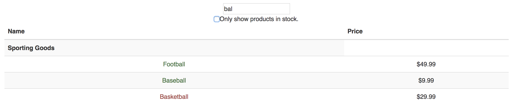
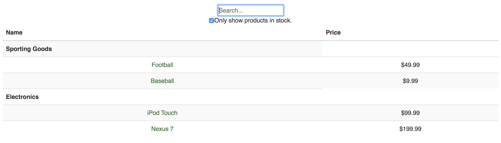
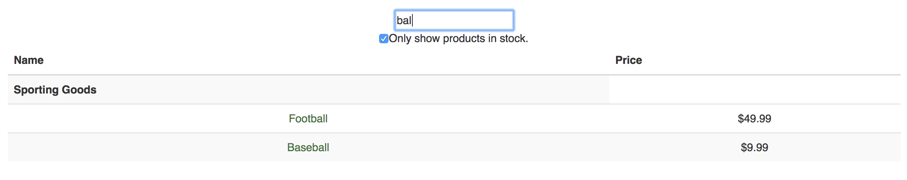

## Inventory Widget
This simple site allows a user to view, search, and filter a sample inventory set.

## Github Link:
[Inventory widget](https://github.com/eddieatkinson/inventory-widget)

## Technologies used:
**Languages**
* JavaScript
* HTML5
* CSS

**Frameworks**
* React
* Bootstrap

## Code snippets:
Format less-than ideal data file:
``` javascript
	formatData(){
		var tempProducts = {};
		this.products.data.map((product)=>{
			if(tempProducts[product.category] === undefined){
				tempProducts[product.category] = [];
			}
			tempProducts[product.category].push(product);
			return null;
		});
		this.setState({
			productsByCategory: tempProducts
		});
	}
```
Real time search functionality as the user types:
``` javascript
	componentWillReceiveProps(newProps){
		const searchTerm = newProps.searchTerm.toLowerCase();
		var tempProducts = [];
		const inStock = newProps.inStock;
		if(inStock){
			this.safeProductData.data.map((item)=>{
				if(item.inStock){
					var itemName = item.name.toLowerCase();
					if(itemName.indexOf(searchTerm) !== -1){
						tempProducts.push(item);
					}
				}
				return null
			});
		}else{this.safeProductData.data.map((item)=>{
				var itemName = item.name.toLowerCase();
				if(itemName.indexOf(searchTerm) !== -1){
					tempProducts.push(item);
				}
				return null
			});
		}
		this.products.data = tempProducts;
		this.formatData();
	}
```
SearchBar component:
``` javascript
class SearchBar extends Component{
	constructor(){
		super();
		this.handleChange = this.handleChange.bind(this);
		this.checkCheck = this.checkCheck.bind(this);
	}
	handleChange(event){
		this.props.onChange(event.target.value);
	}
	checkCheck(event){
		this.props.onCheck($('#checkbox').prop('checked'));
	}
	render(){
		return(
			<form className="search-bar">
				<input onChange={this.handleChange} id="searchTerm" type="text" placeholder="Search..." />
				<div>
					<input id="checkbox" onChange={this.checkCheck} type="checkbox" />Only show products in stock.
				</div>
			</form>
		);
	}
}

export default SearchBar;
```


## Screenshots
All items:

Search:

Filter:

Filter and Search:

